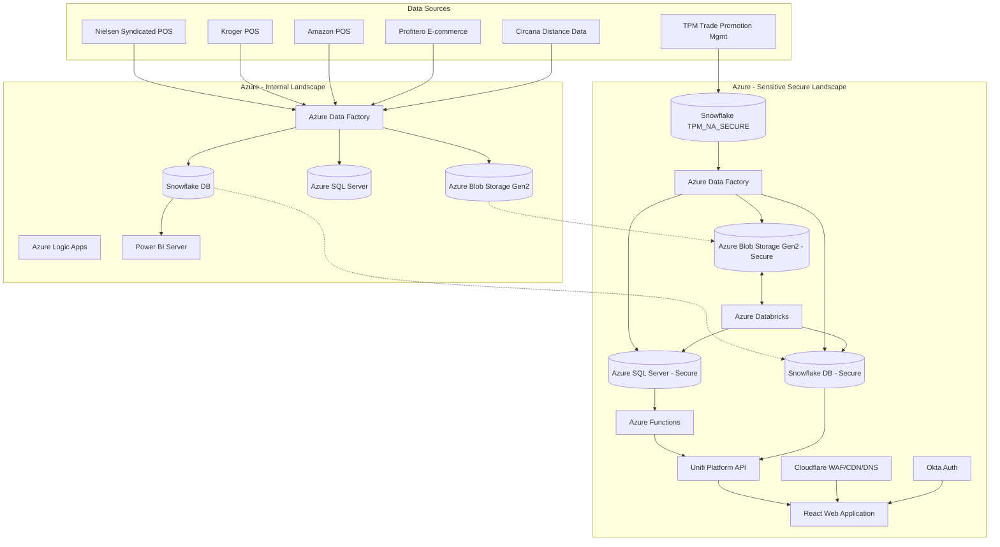

# IRIS Platform Current State Architecture Documentation

This document provides a comprehensive overview of the architecture of the IRIS (Integrated Retail Intelligence System) Analytics Platform.

---

## 1. Executive Summary

The IRIS platform is an enterprise-scale analytics system designed for Kimberly-Clark to ingest, transform, model, and visualize retail sales data. The platform provides insights across multiple descriptive, pricing, trade promotion, and prescriptive analytics products.

The architecture is divided into two primary zones based on data classification:
- **Internal Zone (Data Classification: Internal)**: Manages general retail analytics pipelines and provides read-only data access to the secure landscape.
- **Sensitive Zone (Data Classification: Sensitive)**: A highly secure, isolated environment processing proprietary, sensitive trade data, implementing strict Zero-Trust principles.

---

## 2. End-to-End Conceptual Architecture

---

## 3. Environment Segregation

### 3.1. Internal Landscape (App CI: KCNA Advanced Analytics IRIS)
- **Classification**: Internal Data
- **Function**: Handles standard data orchestration, storage, and reporting. Ingests raw syndicated POS files, aggregates metrics, and loads them into a standard Snowflake data warehouse.
- **Reporting**: Directly serves Power BI Server dashboards for model health monitoring, used by the Data Science team and TPM planners.
- **Cross-Environment Data Transfer**: Data from the Internal landscape can be accessed (Read-Only) by the secure sensitive landscape.

### 3.2. Sensitive Secure Landscape (App CI: KCNA Advanced Analytics Secure IRIS)
- **Classification**: Sensitive Data
- **Function**: Processes highly proprietary model runs, scenario simulations, and competitive analytics.
- **Isolation**: Housed in a separate Azure subscription utilizing private network endpoints, strict network security group (NSG) rules, and network integration with on-prem resources.
- **Security Perimeter**: Protected by Cloudflare (WAF/CDN/DNS) and authenticated strictly via Okta SSO.

---

## 4. Component Directory & Architecture Details

### 4.1. Ingestion and Orchestration (Azure Data Factory & Logic Apps)
- **Azure Data Factory (ADF)**: Acts as the primary pipeline orchestrator. It manages the ingestion schedules, runs directory checks, triggers copy activities, and executes Azure Databricks notebooks.
- **Azure Logic Apps**: Utilized in the Proactive Alerts module to orchestrate notification workflows. Triggered via HTTP request when alerts are compiled, connecting downstream systems to deliver emails.

### 4.2. Storage and Data Lake (Azure Blob Storage Gen2)
- **Internal Blob Storage**: Houses raw incoming files, mapping files, and standard metrics parquets.
- **Sensitive Blob Storage (Secure)**: Stores intermediate dataframes, model run inputs/outputs, and intermediate delta formats.
- **Mounts**: Directories are mounted to Databricks workspace using DBFS mounts (`/mnt/iris-nielsen-models`, `/mnt/iris-kroger-models`, `/mnt/iris-model-output`) via SAS or Account Key authentication backed by Azure Key Vault.

### 4.3. High-Performance Compute (Azure Databricks)
- Runs Python, PySpark, and SQL workloads on Spark clusters.
- Performs cleaning, deduplication, feature engineering (including Prophet modeling via PandasUDF), and statistical model fitting (Bambi/PyMC and OLS via PandasUDF).
- Processes XGBoost classifications for competitive product distancing.

### 4.4. Enterprise Data Warehousing (Snowflake & Azure SQL Server)
- **Snowflake (IRIS Model Data & Secure Database)**:
  - Acts as the gold reporting layer for modeling data.
  - Schema objects are kept updated via DBT models.
  - Houses the secure `TPM_NA_SECURE` database.
- **Azure SQL Server (Backend Application Database)**:
  - Serves as the database for the React web application and Scenario Planner.
  - Implements Row-Level Security (RLS) on sensitive tables like `PEA Data Tables`.
  - Stores RBAC mapping tables (AD Group + Tools/Report Name mapping) and user security tables (User + L4 + L7 mapping).
  - Linked to Databricks via JDBC connectors (`03_UPLOAD_SQL_COEF`, `04_UPLOAD_SQL_FACT`).

### 4.5. Application and API Layer (Azure Functions & Unifi Platform API)
- **Azure Functions**: Intermediary compute microservices that trigger database queries, compute quick simulation results, or communicate with the Unifi API.
- **Unifi Platform (API)**: The central middleware API layer. It enforces Policy Enforcement Points (PEP) for specific tool/dashboard access, fetches report layouts and logic, and returns formatted JSON data to the React frontend.

---

## 5. Security & Network Architecture

### 5.1. Zero-Trust Security Flow
1. **User Authentication**: Okta manages authentication and groups users into AD groups (`IRIS-AD Group`, `PPS-AD Group`, `PEA-AD Group`).
2. **Access Control**: Policy Enforcement Points (PEP) evaluate requests inside the middleware API layer.
3. **Database Security**:
   - Azure SQL Server implements **Row-Level Security (RLS)** mapping User + L4 (Market/Retailer) + L7 (Category) permissions to filter SQL queries.
   - Snowflake enforces RBAC mapping tables that pair AD Groups with allowed tools and reports.
   - Configuration and mapping files are stored securely on Azure Blob Storage.

### 5.2. Network Security
- **VNET Boundaries**: Compute resources (Databricks, Data Factory, SQL Server, and Storage) are hosted inside a private subscription VNET.
- **Network Security Groups (NSGs)**: Controls ingress/egress. Rules are configured to allow access to on-prem resources only.
- **Private Endpoints**: Secure connections to storage accounts and database instances prevent exposure to the public internet.
- **Cloudflare Integration**: Cloudflare acts as the public gatekeeper, managing WAF rules, CDN caching, and DNS resolution for `iris.app.kimclark.com`, routing traffic to the containerized React application gateway.

---

## 6. Power BI Architecture

A dedicated Power BI Server handles reporting for the Internal landscape:
- **Usage**: Model health monitoring by the Data Science team and TPM planners.
- **Data Source**: Direct connection to Snowflake warehouses (`IRIS Model Data`).
- **Data Refresh**: Scheduled refreshes run daily/weekly depending on underlying POS updates.
