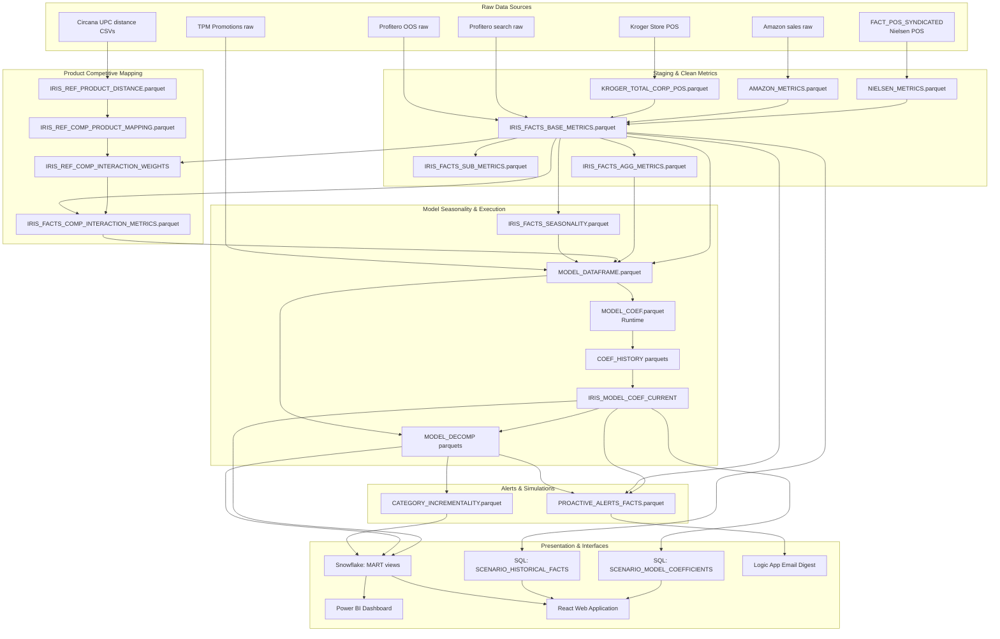

# Data Lineage Diagram — IRIS Platform

This document describes the end-to-end data lineage of the IRIS Platform, tracking datasets from source ingestion to downstream consumption.

---

## 1. End-to-End Data Lineage Flow

