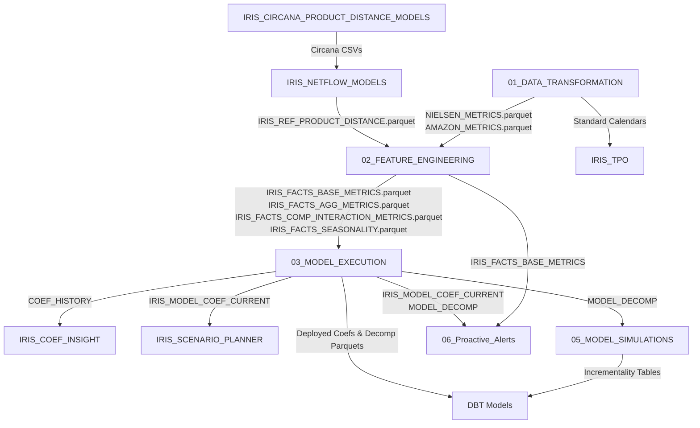

# Module Dependency Diagram — IRIS Platform

This document describes the high-level dependency structure and execution flow across the main software modules of the IRIS Analytics Platform.

---

## 1. Module Execution Dependency Graph

---

## 2. Dependency Descriptions

1. **Circana to Netflow**:
   - `IRIS_CIRCANA_PRODUCT_DISTANCE_MODELS` uses XGBoost models on UPC properties to output CSV pairwise similarity lists.
   - `IRIS_NETFLOW_MODELS` acts as the upload pipeline that reads these CSV files and formats them into Delta/Parquet reference files.
2. **Transformation to Feature Engineering**:
   - POS cleansing processes (`01_DATA_TRANSFORMATION`) write clean tables like `NIELSEN_METRICS` and `AMAZON_METRICS`.
   - Feature engineering (`02_FEATURE_ENGINEERING`) consumes these clean tables to build competitive price matrices and seasonality forecasts.
3. **Feature Engineering to Model Execution**:
   - Modeling frames (`03_MODEL_EXECUTION`) join base facts, brand aggregations, seasonality tables, and competitive features into wide format matrices before running statistics.
4. **Model Execution Outputs Downstream**:
   - Once statistical coefficients are calculated:
     - `IRIS_COEF_INSIGHT` checks historical runs in `COEF_HISTORY` to compile consumption indexes.
     - `IRIS_SCENARIO_PLANNER` reads current deployed coefficients, aggregates them using volume weighting, and pushes them to Azure SQL for front-end access.
     - `05_MODEL_SIMULATIONS` aggregates decomposition outputs to run incrementality models.
     - `06_Proactive_Alerts` consumes deployed coefficients, base facts, and decomposition outputs to execute rolling KPI scans.
5. **DBT Models Execution**:
   - Snowflake schemas are populated with Databricks outputs.
   - DBT runs are executed on Snowflake to standardize analytics reporting tables and check constraints.
