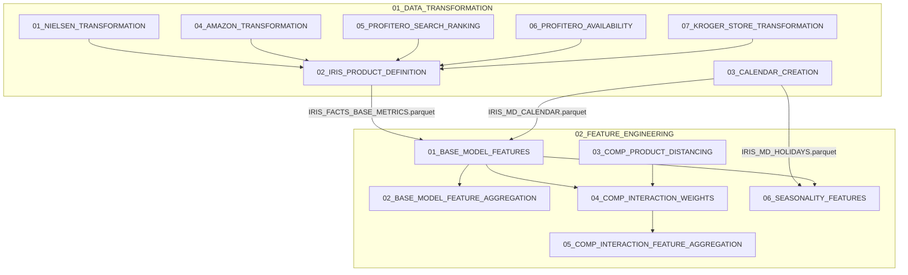
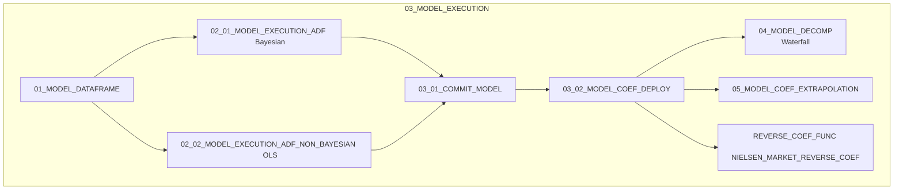
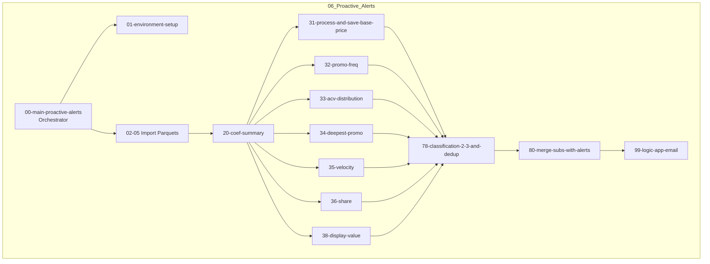

# Notebook Dependency Diagram — IRIS Platform

This document maps the execution paths and dependency relationships between notebooks within each module of the IRIS Platform.

---

## 1. Notebook Execution Flow Diagrams

### 1.1. Data Transformation & Feature Engineering Flow

### 1.2. Model Execution Flow

### 1.3. Proactive Alerts Execution Flow

---

## 2. Shared Functions & Execution Patterns

- **`%run` imports**: Downstream notebooks in `01_DATA_TRANSFORMATION`, `02_FEATURE_ENGINEERING`, `03_MODEL_EXECUTION`, and `06_Proactive_Alerts` run `%run ../00_ADMIN/01_IRIS_FUNCTIONS` as their first step to import shared utilities like price smoothing (`stick_smooth`), metrics aggregations, and catalog configurations.
- **`dbutils.notebook.run` calls**: The alert orchestrator `00-main-proactive-alerts` triggers execution steps (setup, imports, classification, email) and parallelizes the 7 individual KPI checkers using python threads.
